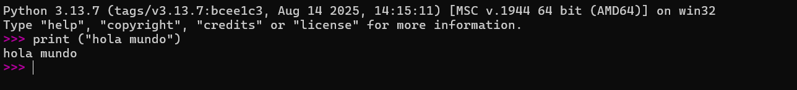

# TLP
Taller de Lenguajes de Programación

Actividad #1

"Hola mundo" en Python

El código a usar es:
print ("hola mundo")

---

#Tarea 997
"Elijan un ejercicio del capítulo uno sección 1.12 y prográmenlo."
El ejercicio a realizar fue el 1.11. En este ejercicio se le pedía al lector que se demostrara como usar "python´s list comprehenesion syntax" para producir una lista con los siguientes dígitos (1, 2 4, 8 ,16, 32, 64, 128, 256)
Observamos que la lista está compuesta de duplicar un número (x*2)
Sabiendo esto realizaremos lo sigueinte:

1) Primero, denominaremos el rango de valores que necesitamos, empezando desde 0 y terminando antes del valor asignado. En este caso, le asignaremos al rango un valor de 9 esto quiere decir que la lista será desde el 0 hasta el 8 (0, 1, 2, 3, 4, 5, 6, 7, 8). Utilizaremos el comando "range(9)". IMPORTANTE, no olvidar agregar el valor i, en donde i obtiene un valor del comando "range(9)", uno a la vez.

2) Después, escribiremos "2**i", esto para dar a entender que se está elevando al cuadrado el valor de i.

3) Antes de finalizar, juntaremos estos dos códigos quedando [2**i for i in a range(9)]

4) Ya por último, le asignaremos un una variable para poder imprimirlo al usuario final quedando:

   "powers_of_two = [2**i for i in a range (9)]"
   "print (powers_of_two)"

---

#Tarea 996
"Elijan un ejercicio del apartado de proyectos del capítulo 2 sección 2.7 y prográmenlo."
Para esta tarea, se eligió el projecto 2.33 en donde realizaremos un código para derivar funciones polinómicas.
Para empezar este código, y sin hacernos muchas bolas, iremos directo al punto:

1) Primero vamos a escribir el comando "polynomial = input("Enter a polynomial: ")". Con esto, le pediremos al usuario que ingrese un polinomio para derivar y luego lo guarda en la variable "polynomial". Por ejemplo "x^5.
2) Después, con el comando "terms = polynomial.replace(" ", "").split("+")" haremos que con el "replace" elimine los espacios y con el "split" separe los términos en una lista.
2.5) Con "derivate = []" lo usaremos para guardar info de la derivada.
3) Luego, escribiremos "for term in terms:" para crear un bulce que vaya por cada termino que separó el comadno "split"
3.5) Con "if "x^" in term:" detectará si hay algún termino elevado a una potencia para después dividirlo en dos partes con el comando "coef, power = term.split("x^")"

